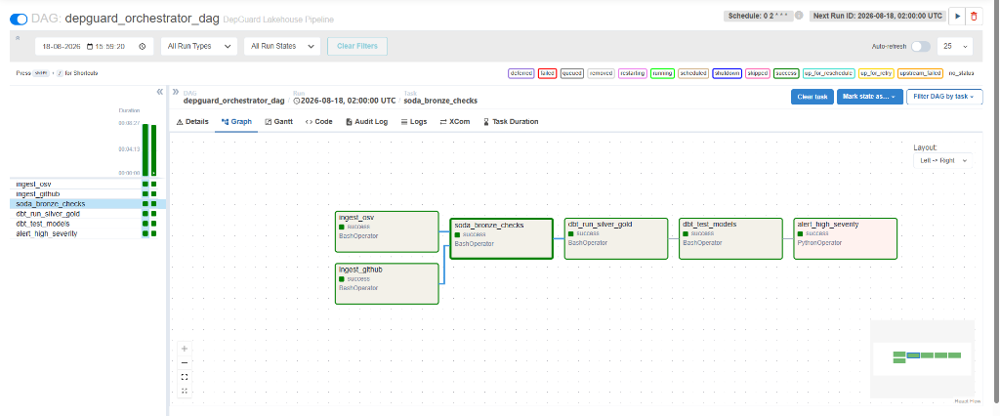
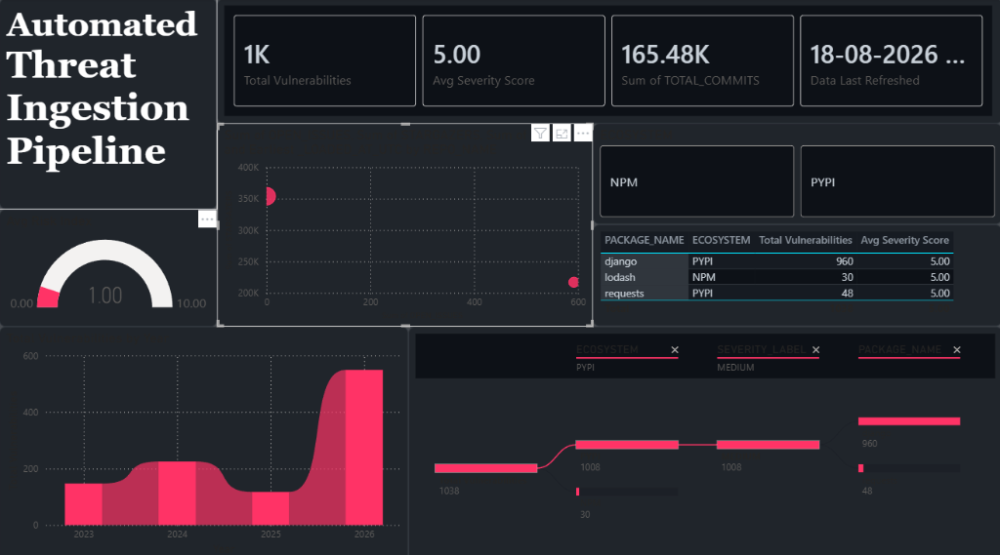

# 🛡️ DepGuard — Open-Source Dependency Risk Intelligence Platform

**DepGuard** is a production-grade, end-to-end Data Lakehouse pipeline that monitors **open-source software supply chain risks**. It ingests live vulnerability data from the [OSV](https://osv.dev/) database and repository health metrics from the [GitHub API](https://docs.github.com/en/rest), transforms them through a medallion architecture (Bronze → Silver → Gold), and surfaces a **Dependency Risk Index (DRI)** via a Power BI dashboard.

---

## 🏗️ Architecture

```
┌──────────────┐     ┌──────────────┐
│   OSV API    │     │  GitHub API  │
└──────┬───────┘     └──────┬───────┘
       │  Python/dlt         │  Python/dlt
       ▼                     ▼
┌─────────────────────────────────────┐
│         BRONZE (Raw Ingestion)      │  ◄── Soda Core DQ Checks
│         Snowflake / DuckDB          │
└──────────────────┬──────────────────┘
                   │  dbt
                   ▼
┌─────────────────────────────────────┐
│        SILVER (Cleaned & Typed)     │
│  silver_cve_incidents               │
│  silver_packages                    │
│  silver_repositories                │
└──────────────────┬──────────────────┘
                   │  dbt
                   ▼
┌─────────────────────────────────────┐
│      GOLD (Dimensional Models)      │
│  fact_vulnerability_incident        │
│  dim_package    dim_repository      │
└──────────────────┬──────────────────┘
                   │
                   ▼
         ┌─────────────────┐
         │  Power BI / BI  │
         └─────────────────┘
```

**Orchestration:** Apache Airflow (Docker) or native Python orchestrator (Windows)



---

## 🧰 Technology Stack

| Layer              | Tool                          |
|--------------------|-------------------------------|
| **Ingestion**      | `dlt` (Data Load Tool)        |
| **Data Warehouse** | Snowflake (+ DuckDB for local)|
| **Transformation** | dbt (Data Build Tool)         |
| **Data Quality**   | Soda Core                     |
| **Orchestration**  | Apache Airflow (Docker)       |
| **Infrastructure** | Terraform                     |
| **Visualization**  | Microsoft Power BI            |

---

## 📂 Project Structure

```
depguard/
├── dags/                              # Airflow DAG definitions
│   └── depguard_orchestrator_dag.py   # Main pipeline DAG
├── scripts/                           # Python ingestion & orchestration
│   ├── ingest_osv.py                  # OSV vulnerability ingestion (dlt)
│   ├── ingest_github.py               # GitHub repo metrics ingestion (dlt)
│   ├── orchestrator.py                # Native Windows orchestrator (no Docker)
│   └── snowflake_init.sql             # Snowflake warehouse/role setup DDL
├── dbt_depguard/                      # dbt project
│   ├── models/
│   │   ├── bronze/sources.yml         # Source definitions
│   │   ├── silver/                    # Cleaned staging models
│   │   └── gold/                      # Dimensional models (star schema)
│   ├── macros/                        # Custom dbt macros
│   ├── dbt_project.yml
│   └── profiles.yml                   # Connection profiles (uses env vars)
├── soda/                              # Soda Core data quality checks
│   ├── configuration.yml              # Soda connection config
│   ├── checks_bronze.yml              # Bronze layer quality checks
│   └── checks_silver.yml              # Silver layer quality checks
├── terraform/                         # IaC for Snowflake resources
│   └── main.tf
├── .env.example                       # Template for environment variables
├── Dockerfile                         # Airflow custom image
├── docker-compose.yml                 # Full Airflow stack (Postgres, Webserver, Scheduler)
├── DepGuard_Cyber_Theme.json          # Custom Power BI dark theme
└── requirements.txt                   # Python dependencies
```

---

## 🚀 Getting Started

### Prerequisites

- Python 3.10+
- Docker Desktop (for Airflow) **or** native Python (for Windows orchestrator)
- A Snowflake account
- A GitHub Personal Access Token

### 1. Clone & Configure

```bash
git clone https://github.com/<your-username>/depguard.git
cd depguard
cp .env.example .env
# Edit .env with your Snowflake and GitHub credentials
```

### 2. Initialize Snowflake

Run the DDL script in your Snowflake worksheet to create the database, warehouse, schemas, and role:

```sql
-- Execute contents of scripts/snowflake_init.sql in Snowflake
```

### 3a. Run with Apache Airflow (Recommended)

```bash
docker compose up -d --build
```

Open [http://localhost:8080](http://localhost:8080) and log in with `admin` / `admin`.  
Unpause the `depguard_orchestrator_dag` and trigger it manually.

### 3b. Run Natively on Windows (No Docker)

```powershell
pip install -r requirements.txt
python scripts/orchestrator.py
```

---

## 📊 Data Catalog

### Gold Layer (Star Schema)

| Model | Type | Description |
|-------|------|-------------|
| `fact_vulnerability_incident` | Fact | Each row is a CVE linked to a package with severity scores and the calculated Dependency Risk Index (DRI). |
| `dim_package` | Dimension | Unique packages tracked across ecosystems (PyPI, npm). |
| `dim_repository` | Dimension | GitHub repository health metrics (stars, forks, open issues, commits). |

### Silver Layer (Cleaned)

| Model | Description |
|-------|-------------|
| `silver_cve_incidents` | Parsed and typed vulnerability records from OSV. |
| `silver_packages` | Deduplicated package list with ecosystem classification. |
| `silver_repositories` | Cleaned GitHub repository metrics. |

---

## 📈 Power BI Dashboard

The project includes a custom cybersecurity-themed Power BI configuration (`DepGuard_Cyber_Theme.json`) with a dark UI and neon accent colors.

**Key Visuals:**
- KPI Cards (Total Vulnerabilities, Avg Severity Score)
- Decomposition Tree (drill down by Ecosystem → Severity → Package)
- Ribbon Chart (vulnerability timeline by ecosystem)
- Dynamic severity-colored data table
- Interactive slicers (Ecosystem, Severity)
- GitHub repository health scatter plot



---

## 🔒 Security Notes

- **Never commit `.env`** — it is excluded via `.gitignore`.
- The `profiles.yml` uses `env_var()` to read credentials from environment variables at runtime.
- The `.env.example` file contains only placeholder values and is safe to commit.

---

## 📝 License

This project is for educational and portfolio demonstration purposes.
